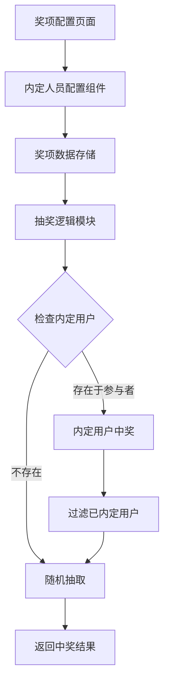

## Product Overview

为现有抽奖系统增加"内定中奖人"功能，允许管理员在配置奖项时预先指定某些用户必定中奖，提升抽奖系统的灵活性和可控性。

## Core Features

- **内定人员配置**：在奖项配置页面为每个奖项添加"内定人员"配置项，支持选择或输入内定中奖用户
- **人数限制校验**：内定人数不得超过该奖项的中奖人数上限（count字段）
- **智能抽奖逻辑**：抽奖时优先检查内定用户是否在参与者名单中，若存在则优先中奖；不足部分从剩余参与者中随机抽取
- **已内定用户过滤**：随机抽取时自动排除已被内定的用户，确保公平性

## Tech Stack

- 前端框架：React + TypeScript
- 样式方案：Tailwind CSS
- 数据持久化：LocalStorage（复用现有方案）

## Tech Architecture

### System Architecture

基于现有抽奖系统架构进行扩展，主要涉及奖项配置模块和抽奖逻辑模块的修改。



### Module Division

- **奖项配置模块**：扩展现有奖项配置，增加内定人员字段
- **内定人员选择组件**：新增UI组件，支持从参与者列表中选择内定用户
- **抽奖逻辑模块**：修改现有抽奖算法，增加内定用户优先中奖逻辑

### Data Flow

1. 用户在奖项配置页面设置内定人员
2. 内定人员信息随奖项配置保存至LocalStorage
3. 抽奖时读取奖项配置，提取内定人员列表
4. 执行内定优先抽奖算法，返回最终中奖名单

## Implementation Details

### Core Directory Structure

```
src/
├── components/
│   └── RiggedWinnerSelector.tsx  # 新增：内定人员选择组件
├── types/
│   └── index.ts                   # 修改：扩展Prize类型定义
└── utils/
    └── lottery.ts                 # 修改：扩展抽奖算法
```

### Key Code Structures

**Prize类型扩展**：在现有奖项类型中增加riggedWinners字段，用于存储内定中奖人员列表。

```typescript
interface Prize {
  id: string;
  name: string;
  count: number;
  riggedWinners?: string[];  // 新增：内定中奖人员ID列表
}
```

**抽奖算法扩展**：修改现有抽奖函数，增加内定用户优先处理逻辑。

```typescript
function drawPrize(
  prize: Prize,
  participants: string[],
  excludeList: string[]
): string[] {
  const winners: string[] = [];
  const riggedWinners = prize.riggedWinners || [];
  
  // 1. 优先处理内定用户
  for (const rigged of riggedWinners) {
    if (participants.includes(rigged) && !excludeList.includes(rigged)) {
      winners.push(rigged);
    }
  }
  
  // 2. 随机抽取剩余名额
  const remaining = prize.count - winners.length;
  const availablePool = participants.filter(
    p => !winners.includes(p) && !excludeList.includes(p) && !riggedWinners.includes(p)
  );
  
  // 随机抽取逻辑...
  return winners;
}
```

### Technical Implementation Plan

#### 内定人员配置功能

1. **问题陈述**：需要在奖项配置中增加内定人员选择功能
2. **解决方案**：创建可复用的内定人员选择组件，支持多选和人数校验
3. **关键技术**：React多选组件、表单校验
4. **实现步骤**：

- 扩展Prize类型定义
- 创建RiggedWinnerSelector组件
- 集成到奖项配置页面
- 添加人数上限校验逻辑

#### 抽奖算法改造

1. **问题陈述**：现有抽奖算法需支持内定用户优先中奖
2. **解决方案**：在抽奖函数中增加内定用户预处理逻辑
3. **关键技术**：数组过滤、集合运算
4. **实现步骤**：

- 提取内定用户列表
- 校验内定用户是否在参与者名单中
- 将有效内定用户加入中奖名单
- 从剩余池中随机抽取补足名额

## Agent Extensions

### SubAgent

- **code-explorer**
- Purpose：探索现有项目结构，理解奖项配置页面和抽奖逻辑的实现方式
- Expected outcome：获取现有Prize类型定义、奖项配置组件结构、抽奖算法实现细节